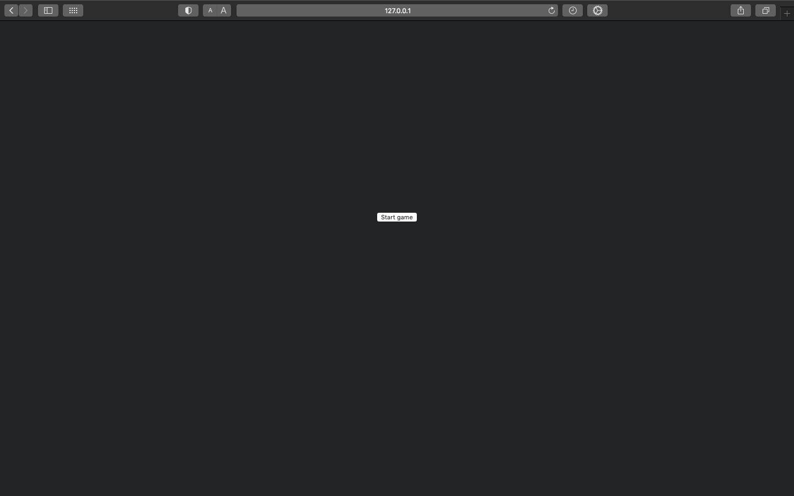
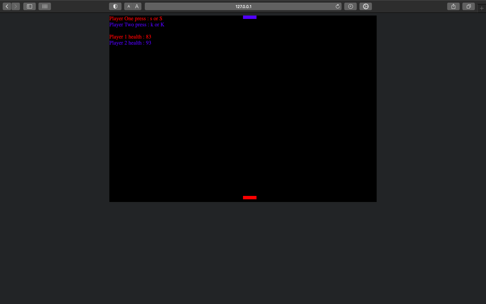
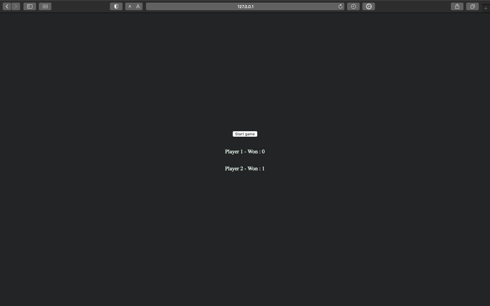
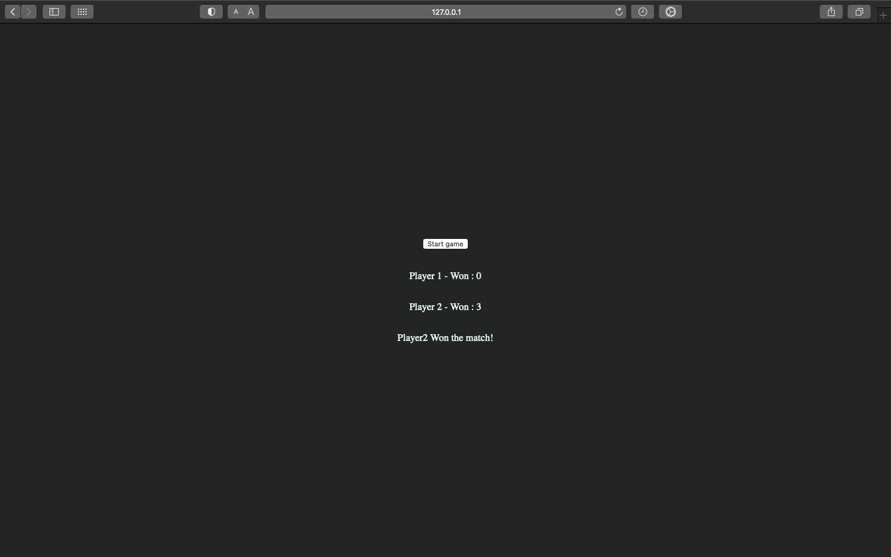

# 2D-Two-Player-game-using-java

<h1>Start page</h1>

To play the game press Start

<h1>Game page</h1>

Player One is Red

Player One Fire button : s or S

 

Player Two is Red

Player Two Fire button : k or K

Who won 3 games first that player Won the match

